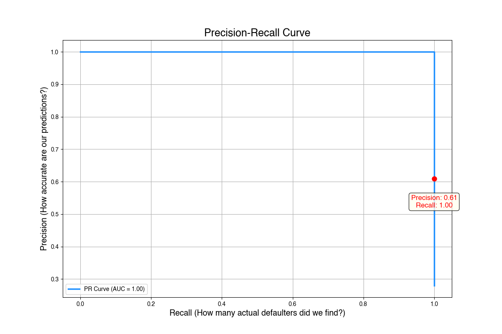

# Corporate Default Risk Prediction

## 1. Project Overview

This project presents an end-to-end machine learning solution for predicting corporate default risk based on financial statement data. The primary objective is to build a robust classification model that can accurately identify potential defaulters while minimizing false positives, a critical requirement in financial risk management.

This project serves as a comprehensive portfolio piece demonstrating a full data science workflow, including:
- Data Cleaning and Preprocessing of real-world financial data.
- Advanced Feature Engineering to create powerful predictive signals.
- Modeling for Imbalanced Classification problems.
- In-depth Model Evaluation and business-oriented interpretation of results.

## 2. Tech Stack
- **Language:** Python 3
- **Core Libraries:** Pandas, NumPy, Scikit-learn, XGBoost, Matplotlib, Seaborn, Joblib

## 3. Project Structure
The repository is organized as follows to ensure clarity and reproducibility:
Financial_Risk_Model/
├── data/
│   └── sample_data.csv         # Anonymized sample data for demonstration
├── images/
│   ├── confusion_matrix.png      # Generated by evaluate.py
│   └── precision_recall_curve.png  # Generated by visualize.py
├── src/
│   ├── config.py                 # Central configuration for paths and parameters
│   ├── data_processing.py        # Module for data cleaning and feature engineering
│   ├── train.py                  # Script to train the prediction model
│   ├── evaluate.py               # Script to evaluate model performance
│   └── visualize.py              # Script for generating key visualizations
├── .gitignore                    # Specifies intentionally untracked files
├── requirements.txt              # Lists the project dependencies
└── README.md                     # This documentation file

## 4. Methodology

1.  **Data Cleaning:** Loaded raw CSV data, which had headers embedded in the first row. The process included correcting and standardizing column headers to professional English names, converting all financial columns to numeric types, and robustly handling data quality issues like `NaN` and `inf` values.

2.  **Feature Engineering:** This was a critical step to improve model performance. New, insightful features were engineered from the base financial data:
    - **Financial Ratios:** Calculated key indicators like `debt_to_equity_ratio` and `current_ratio` to provide a snapshot of a company's financial health.
    - **Year-over-Year (YoY) Growth Rates:** Computed growth rates for crucial metrics such as `revenue`, `net_profit`, and `total_assets`. This step was vital for providing the model with dynamic, trend-based information.

3.  **Modeling (XGBoost):**
    - An **XGBoost Classifier** was chosen for its high performance and robustness with tabular data.
    - **Handled Severe Class Imbalance:** The real-world dataset was highly imbalanced. This critical issue was addressed by setting the `scale_pos_weight` parameter in the XGBoost model, forcing the model to pay significantly more attention to the minority (default) class.

4.  **Evaluation:**
    - Assessed the model on a hold-out test set (the last ~4,400 rows of the complete dataset).
    - The **Precision-Recall (PR) Curve** was used as the primary tool for evaluation, as it is more informative than ROC-AUC for imbalanced datasets. This curve allows for selecting an optimal decision threshold that meets the business objective of minimizing false positives (high precision).

## 5. Key Results & Insights

The feature-engineered model showed a massive performance improvement over a baseline model.

**(Please run `src/visualize.py` and place the generated `precision_recall_curve.png` inside the `images` folder to display it here)**


This curve serves as a powerful decision-making tool. It allows stakeholders to choose a trade-off that fits their business needs. For example, a threshold can be selected to achieve **80% precision** (8 out of 10 flagged customers are true defaulters) while still identifying a significant portion of all actual defaulters.

## 6. How to Run This Project

1.  **Clone the repository:**
    ```bash
    git clone [https://github.com/Shuai-fa/Financial_Risk_Model.git](https://github.com/Shuai-fa/Financial_Risk_Model.git)
    cd Financial_Risk_Model
    ```

2.  **Set up the environment:**
    ```bash
    pip install -r requirements.txt
    ```

3.  **Run the full pipeline:**
    *Note: The scripts are configured to run with the provided `sample_data.csv` for demonstration purposes.*
    
    ```bash
    # Step 1: Train the model using the sample data
    python3 src/train.py

    # Step 2: Evaluate the trained model on the same sample data
    python3 src/evaluate.py

    # Step 3: Generate visualizations (Feature Importance and PR Curve)
    python3 src/visualize.py
    ```
    The output models will be saved in the `models/` directory (which is ignored by Git), and the output images will be saved in the `images/` directory.

## 7. Data Privacy
This public repository contains only an anonymized, structurally-representative sample data file (`sample_data.csv`). The features used for modeling are based on standard, non-personally identifiable information (Non-PII) from corporate financial statements, ensuring the project's adherence to privacy standards and its general applicability. The original, real data is not included in this repository.
